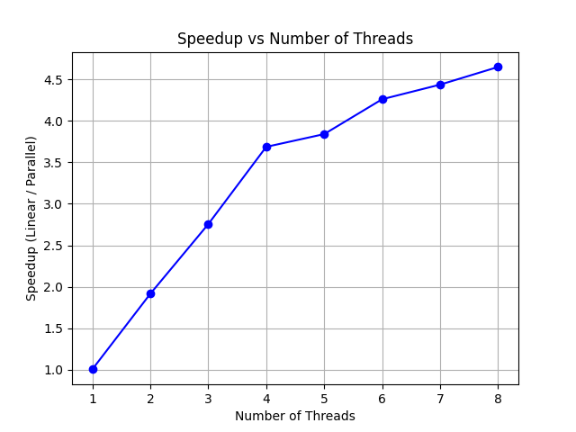

# Floyd-Warshall Parallelization with OpenMP

## 1. Algorithm & Parallelization Method

### Floyd-Warshall Algorithm

The Floyd-Warshall algorithm is an all-pairs shortest path algorithm that finds the shortest paths between all pairs of vertices in a weighted graph. The algorithm works by progressively improving the estimate of the shortest path between two vertices, considering intermediate vertices. The time complexity of the Floyd-Warshall algorithm is \(O(V^3)\), where \(V\) is the number of vertices in the graph.

### Parallelization with OpenMP

This implementation uses OpenMP for parallelization, which is a shared-memory parallel programming model. The key step in the Floyd-Warshall algorithm that we parallelize is the triple nested loop that iterates over all pairs of vertices with a common intermediate vertex.

The outer two loops (over \(i\) and \(j\)) are independent and can be parallelized using OpenMP’s `#pragma omp parallel for`. This allows the algorithm to process multiple vertex pairs simultaneously, improving the computation time.

## 2. Reproducing Results & Starting the Algorithm

### Requirements:

- **C++ compiler** with OpenMP support (e.g., GCC or Clang)
- **CMake** (optional, if building with CMake)
- **OpenMP enabled** during compilation (e.g., `-fopenmp` flag for GCC/Clang)

### Instructions to Reproduce Results:

1. **Clone the repository**:

   ```bash
   git clone https://github.com/yourusername/floyd-warshall-parallel.git
   cd floyd-warshall-parallel
   ```

2. **Generate a graph**:
   The program automatically generates a random graph with 1000 nodes and a 50% connection probability. However, you can modify the graph generation logic in the code to use your own data if necessary.

3. **Build the Program**:
   Using **Clang++**:

   ```bash
   clang++ -o main.o main.cpp -fopenmp -O0
   ```

   Or, using **GCC**:

   ```bash
   g++ -o main.o main.cpp -fopenmp -O0
   ```

4. **Run the Program**:

   ```bash
   ./main.o
   ```

   The program will output the generated graph, show the execution time of both the sequential and parallel implementations, and print the speedup for different numbers of threads.

### Input Data Format:

The graph is generated within the code itself. If you want to use an external dataset, you can modify the graph creation section to read from a file. The graph should be represented as an adjacency matrix, where:

- Each row represents a vertex.
- Each element at `adjMatrix[i][j]` represents the edge weight between vertex `i` and vertex `j` (if there is no edge, set it to infinity or a large value).

### Data Files:

If you need to run the algorithm on specific datasets or benchmarks, you can add your own dataset files to the repository. You can link the dataset files here or include them directly in the repo.

## 3. Parallelization Details

The parallelization is done in the core part of the Floyd-Warshall algorithm where the matrix is updated. Specifically, the following nested loop structure is parallelized:

```cpp
for (int k = 0; k < V; ++k) {
  for (int i = 0; i < V; ++i) {
    for (int j = 0; j < V; ++j) {
      if (dist[i][k] < INF && dist[k][j] < INF) {
        dist[i][j] = std::min(dist[i][j], dist[i][k] + dist[k][j]);
      }
    }
  }
}
```

This is done using OpenMP's `#pragma omp parallel for collapse(2)` directive to parallelize the outer two loops over `i` and `j`, ensuring that the calculations for different pairs of vertices are done concurrently.

## 4. Speedup Calculation

### Speedup Formula:

Speedup is calculated as the ratio of the execution time of the algorithm in a single-threaded (sequential) version to the execution time in the parallel version:

> Speedup = Time_sequential / Time_parallel

### Speedup Results:

The following results show the speedup for different numbers of threads used in the parallel version of the algorithm. The graph represents the dependency between the number of threads and the speedup.

#### Results:

- **Threads**: 1 2 3 4 5 6 7 8
- **Speedups**: 1.00564 1.91536 2.75457 3.68615 3.83974 4.25977 4.43579 4.64856

#### Speedup vs. Number of Threads:

You can plot the speedup against the number of threads using a graphing tool. A simple plot shows the diminishing returns as the number of threads increases:



This plot illustrates the performance improvements as more threads are used but also indicates the point of diminishing returns after a certain number of threads.

---
